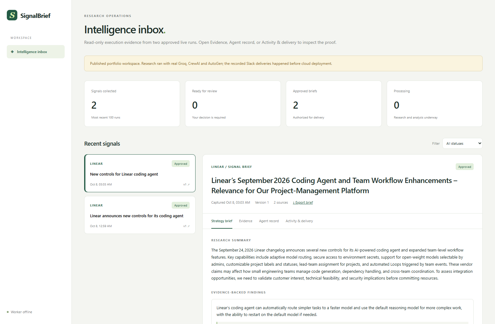
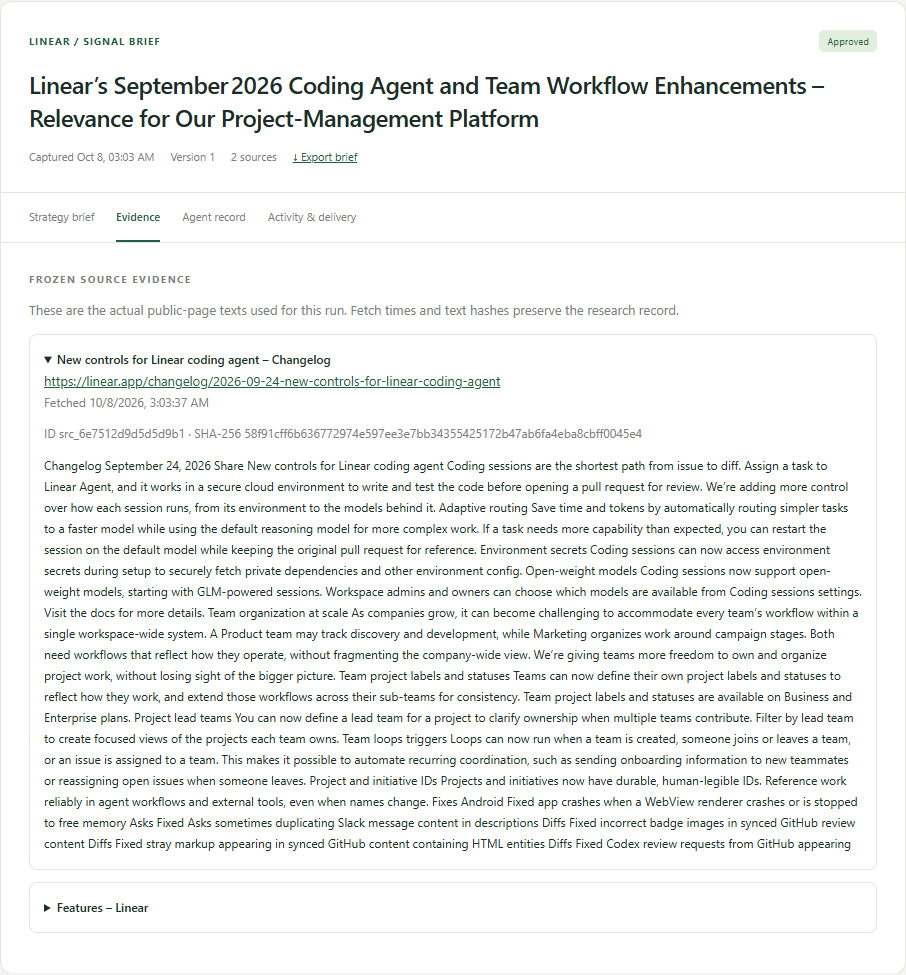
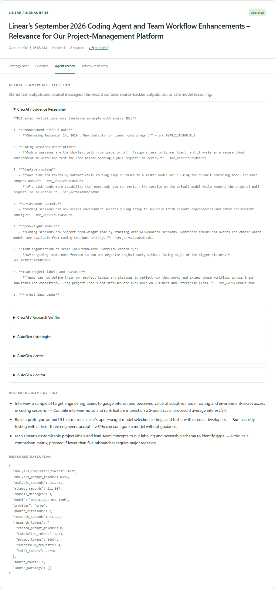
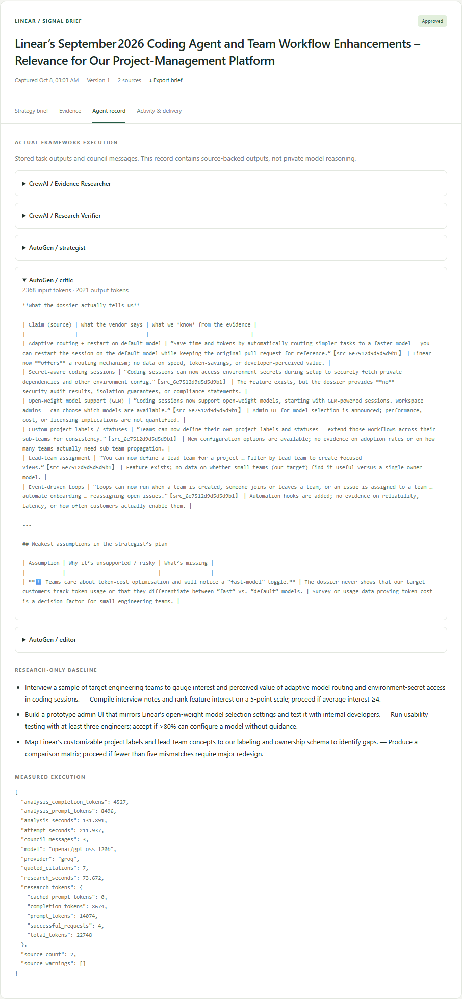
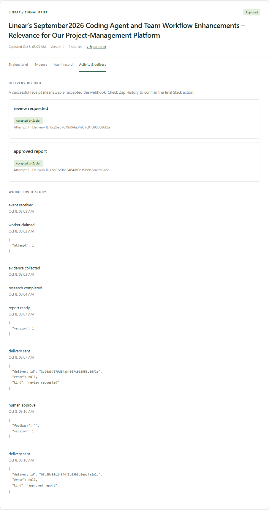
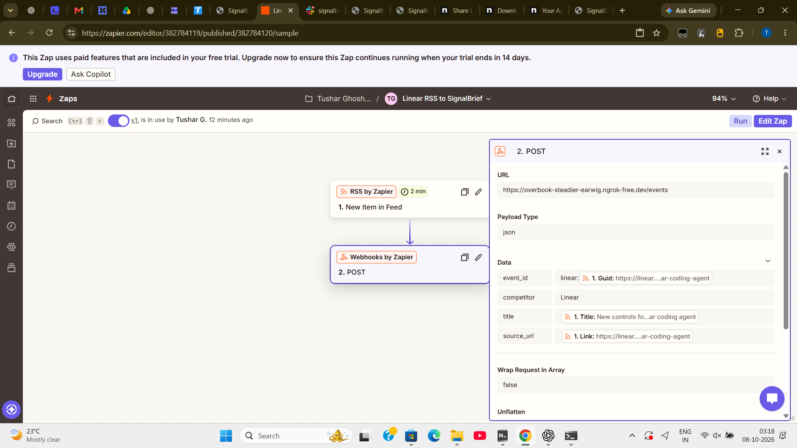
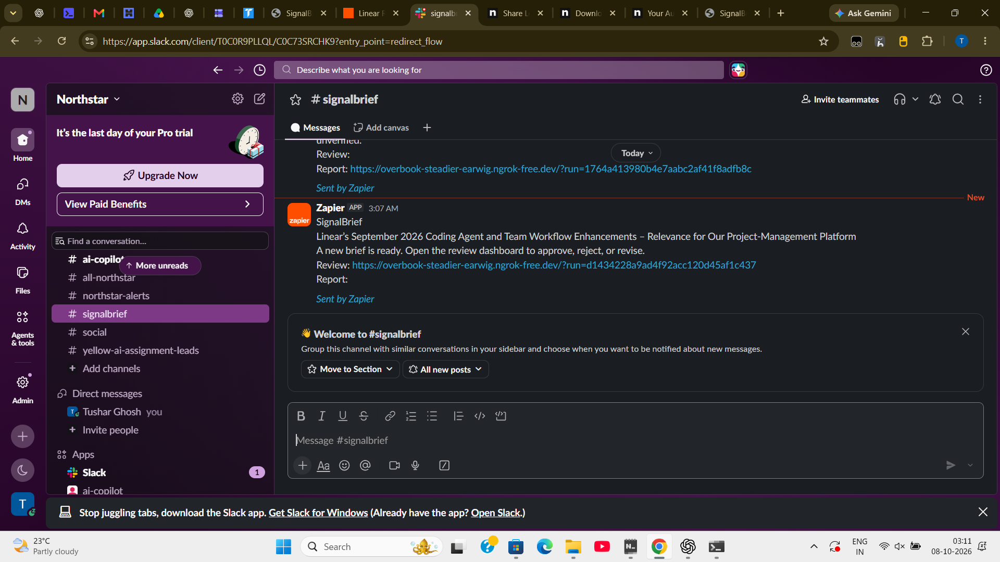
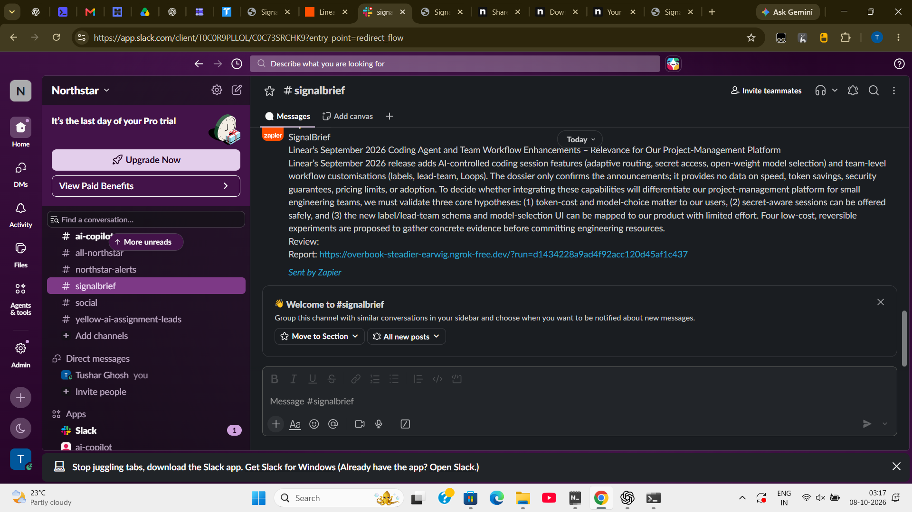
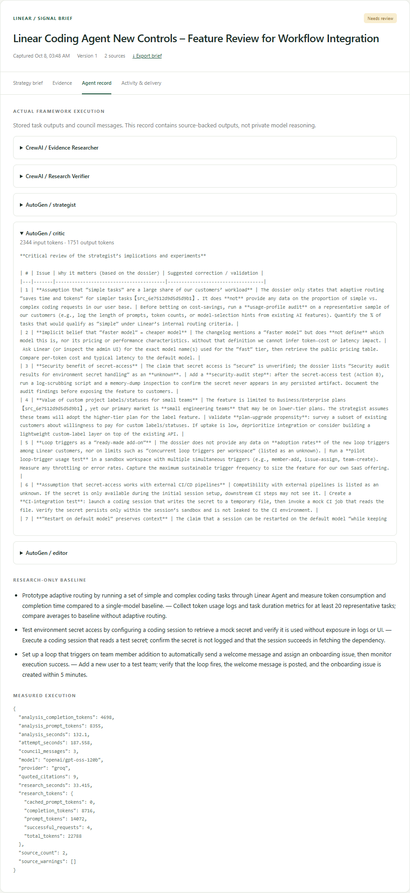

# SignalBrief

### Competitor announcement → verified research → challenged strategy → human decision

[](https://github.com/tusharg007/signalbrief-competitive-intelligence/actions/workflows/ci.yml)


**A working competitive intelligence application that keeps evidence, agent outputs, and human approval attached to every strategic brief.**

[**Open the live portfolio workspace ↗**](https://signalbrief-dncb.onrender.com/showcase?run=d1434228a9ad4f92acc120d45af1c437) · [Deployment guide](docs/DEPLOYMENT.md) · [Verification record](docs/VERIFICATION.md) · [Architecture](docs/ARCHITECTURE.md)



When a competitor announces a feature, a product team needs more than a summary. SignalBrief collects the original announcement, builds a cited dossier with CrewAI, asks an AutoGen council to challenge the implications, and presents concrete validation experiments for a human reviewer. Zapier connects the feed to the application and delivers review requests and approved summaries to Slack.

The application uses real HTTPS sources and Groq inference. Reports are generated by the actual frameworks and persisted with their execution records. The public workspace exposes **two selected, previously approved live runs**; submission and approval stay behind operator authentication. These historical records were preserved during deployment without replaying notifications.

## What has actually been verified?

The RSS-triggered run [`d1434228a9ad4f92acc120d45af1c437`](https://signalbrief-dncb.onrender.com/showcase?run=d1434228a9ad4f92acc120d45af1c437) completed:

**Linear RSS → published Zapier POST → source collection → CrewAI → AutoGen → Slack review request → human approval → approved brief in Slack.**

| Recorded evidence | Result |
| --- | --- |
| Original public sources preserved | 2, with fetch timestamps and SHA-256 text hashes |
| Research dossier | 6 findings; 7 citation excerpts checked against stored text |
| Framework execution | 2 CrewAI task outputs and 3 AutoGen council messages |
| Actual model provider | Groq, `openai/gpt-oss-120b` |
| Research-only / final actions | 3 / 4, with owners, evidence references, and validation steps |
| Critic objections | 4 |
| Recorded research / council duration | 73.672 / 131.891 seconds |
| Approval and downstream delivery | Persisted human approval; review request and approved report seen in Slack |
| Hosted checks | Render readiness, Neon records, public access, admin login, duplicate ingress |
| Regression suite | 49 tests pass locally with SQLite and again with PostgreSQL; CI covers Windows, Linux, and PostgreSQL |

These successful-run measurements are not a throughput benchmark or billing estimate. Exact excerpts establish traceability, not factual entailment. More actions do not establish better strategy. The saved baseline makes the additional cost and benefit of critique inspectable.

## Proof gallery

Each screenshot records a specific part of the working system. App captures show the real persisted RSS run. Zapier and Slack captures were supplied by the operator during live verification. These are actual interfaces, not generated mockups.

### 1. Evidence stays attached to the source



**Validates:** actual public-page text, source URL, fetch timestamp, and text hash used by the agents. Citation excerpts are checked against this packet. A hash preserves the record; it does not certify the publisher's claims.

### 2. CrewAI performed the research



**Validates:** output from the CrewAI researcher, a separate verifier task, baseline actions, and recorded token usage. The research contract carries exact source excerpts alongside structured findings.

### 3. AutoGen challenged the strategy



**Validates:** the strategist → critic → editor conversation. The critic calls out missing adoption, performance, and security evidence. The record retains actual message outputs, token counts, and stage duration; the final actions remain proposed experiments.

### 4. Approval and delivery are auditable



**Validates:** stable delivery IDs, attempt counts, and a human decision tied to a report version. A backend receipt proves Zapier acceptance; the Slack captures below validate the downstream action separately.

### 5. Zapier ingestion was published and enabled



**Validates:** the RSS trigger and mapped POST existed in a published, enabled Zap. This historical screenshot shows the ngrok address used for that run. The hosted endpoint is `https://signalbrief-dncb.onrender.com/events`; the operator confirmed the published Zap URL was switched to Render on 8 October 2026.

### 6. Slack received the review request



**Validates:** the outbound Catch Hook → Slack action delivered a review request for this exact run. The reviewer follows the link to the authenticated dashboard.

### 7. Slack received the approved report



**Validates:** the reviewed summary reached Slack after approval, beyond merely obtaining an HTTP 200 webhook receipt. Historical ngrok links identify the original local verification session.

### 8. Fresh execution on Render



**Validates:** a new run executed on the hosted Render worker after deployment, using Groq and two public Linear sources. Run `357d68840b1a43e0afb44834b1b64c05` saved five actual agent outputs and a validated report in Neon. Its review-request webhook was accepted by Zapier on the first attempt. The report remains awaiting human approval; downstream Slack appearance for this new notification has not been independently checked. The public showcase continues to expose only the two approved historical runs.

## Architecture and framework roles

```mermaid
flowchart LR
    RSS[Competitor RSS] --> Z1[Zapier authenticated POST]
    Z1 --> API[FastAPI ingress and deduplication]
    API --> DB[(Neon PostgreSQL)]
    DB --> Worker[Leased worker]
    Worker --> Sources[Allowlisted HTTPS collector]
    Sources --> Crew[CrewAI researcher and verifier]
    Crew --> Council[AutoGen strategist, critic, editor]
    Council --> Review[Human dashboard review]
    Review --> Outbox[Transactional delivery outbox]
    Outbox --> Z2[Zapier Catch Hook]
    Z2 --> Slack[Review request or approved brief]
```



| Component | Responsibility | Design reason |
| --- | --- | --- |
| CrewAI | Dependent research and verification tasks | Structured, evidence-grounded dossier with an explicit output contract |
| AutoGen AgentChat | Bounded propose / challenge / synthesize discussion | Inspectable critique with a retained research-only baseline |
| Zapier | RSS ingestion and Slack integration | Business workflows connect to backend-owned approval authority |
| FastAPI | Ingress, dashboard, review, exports, public showcase | Usable controls and inspectable state |
| PostgreSQL / SQLite | Queue, evidence, checkpoints, versions, outbox, audit | Persistent state and recoverable execution |
| Groq | Model inference for both real adapters | Verified with `openai/gpt-oss-120b` |
| Render + Neon | Public HTTPS app and external persistent database | Records survive container restarts and redeploys |

Using two frameworks increases latency and token cost; improvement is not presumed. The baseline and evaluation command expose that trade-off. AutoGen is in maintenance mode, so its adapter is isolated in `signalbrief/agents.py`. See [Microsoft's project status](https://github.com/microsoft/autogen).

## Engineering beyond the prompts

- **Atomic deduplication:** an identical event resolves to the existing run; a changed payload under the same ID is rejected.
- **Recovery:** expiring leases, ownership tokens, heartbeats, and checkpoints protect against stale workers and preserve completed evidence/research.
- **Evidence boundary:** exact host allowlists, public-IP checks, DNS-pinned TLS, redirect validation, bounded text, and checked citation references.
- **Version-bound review:** approve, reject, or request one revision. Stale approvals and obsolete deliveries are rejected.
- **Durable outbox:** stable IDs, bounded retries, safe receipts, and at-least-once delivery. Ambiguous downstream timeouts can produce duplicates.
- **Operator security:** signed HttpOnly sessions, CSRF/origin checks, database-backed login throttling, and a separate webhook credential.
- **Public proof:** only explicitly selected approved runs are published; webhook payloads and credentials stay private.
- **Measured execution:** actual task outputs, council messages, token usage, durations, and a structural baseline comparison.

The PostgreSQL adapter serializes short workspace transitions with a transaction-scoped advisory lock, matching the SQLite transaction contract. Model and HTTP calls hold no database lock. This is a deliberate single-workspace design.

## Run locally

Requires Python 3.11 and [uv](https://docs.astral.sh/uv/).

```powershell
uv sync --frozen --extra dev --python 3.11
uv run python -m signalbrief.setup
```

Save the real model key and Catch Hook in the generated, ignored `.env`:

```dotenv
LLM_PROVIDER=groq
LLM_MODEL=openai/gpt-oss-120b
GROQ_API_KEY=your-provider-key
ZAPIER_HOOK_URL=https://hooks.zapier.com/hooks/catch/YOUR_ACCOUNT/YOUR_HOOK/
PUBLIC_BASE_URL=http://localhost:8000
```

Setup generates authentication secrets and never overwrites an existing `.env`. `LLM_API_KEY`, if set, takes precedence. SQLite is the local default; set `DATABASE_URL` for PostgreSQL.

Run in two terminals:

```powershell
uv run uvicorn signalbrief.api:create_app --factory --host 127.0.0.1 --port 8000 --no-proxy-headers
uv run python -m signalbrief.worker
```

Open `http://localhost:8000` and sign in with the local `ADMIN_PASSWORD`. Windows users can use `scripts/start.ps1`; it accepts missing integration secrets through hidden, session-only input. Define competitors and exact source hosts in `competitors.json`; the included company context is synthetic.

[Detailed local setup and evaluation](docs/LOCAL_SETUP.md) · [Zapier field mapping](docs/ZAPIER.md) · [Slack walkthrough](docs/CONNECT_SLACK_AND_GO_LIVE.md)

## Hosted access

**Public portfolio:** [signalbrief-dncb.onrender.com/showcase](https://signalbrief-dncb.onrender.com/showcase)  
**Operator login:** [signalbrief-dncb.onrender.com](https://signalbrief-dncb.onrender.com)  
**Readiness:** [signalbrief-dncb.onrender.com/ready](https://signalbrief-dncb.onrender.com/ready)

The full API and worker run together on a free Render web service. Neon PostgreSQL stores evidence and workflow state outside the container. `render.yaml` describes the service; `signalbrief/hosted.py` manages the worker lifetime alongside the API.

Free Render instances sleep after 15 minutes without inbound traffic and can take about a minute to wake. This is a portfolio deployment, with no always-on production SLA. See [Render's free-service limits](https://render.com/docs/free). Groq, Neon, Render, and Zapier quotas still apply; webhook automation requires an eligible Zapier plan after the trial. Saved public briefs do not require a visitor account.

[Deployment, secrets, RSS cutover, and operations](docs/DEPLOYMENT.md). Never include an administrator password or webhook key in a resume link.

## Verification and limits

```powershell
uv run ruff check signalbrief scripts tests
uv run pytest -q
uv run signalbrief-evaluate --run-id YOUR_COMPLETED_RUN_ID
```

Tests cover concurrent deduplication, claims, expired leases, checkpoint recovery, stale reviews, version history, citations, provider failures, retries, authentication, and public-showcase boundaries. Regression provider fixtures are isolated from the real Groq and Slack execution documented above. CI runs the same suite against PostgreSQL.

This implementation supports one trusted workspace, a bounded evidence packet, three council turns, and one requested revision. Agents have no shell or arbitrary browsing tools. Slack links to dashboard review; native Slack approval buttons are outside the scope. Daily run limits and request timeouts constrain execution but are not hard currency budgets. CrewAI runs in a thread; Python cannot forcibly terminate a blocked native thread.

Source-ID and quote checks do not replace human judgment. Multi-tenant identities, SSO/RBAC, independent entailment evaluation, strict process isolation, and downstream completion callbacks remain future work.

## Explore the code

| Path | Inspect |
| --- | --- |
| `signalbrief/agents.py` | Actual framework adapters and structured contracts |
| `signalbrief/sources.py` | HTTPS collection and source restrictions |
| `signalbrief/store.py`, `database.py` | Workflow transitions and SQLite/PostgreSQL persistence |
| `signalbrief/worker.py`, `hosted.py` | Checkpointed execution and hosted worker lifetime |
| `signalbrief/api.py`, `static/` | Authenticated dashboard and public portfolio workspace |
| `signalbrief/delivery.py` | Real Zapier delivery and receipts |
| `scripts/import_approved.py` | Preserve real approved records without replaying delivery |
| `scripts/capture_proof.cjs` | Reproduce actual evidence screenshots |
| `tests/`, `.github/workflows/ci.yml` | Workflow, access boundaries, backend parity |

[Resume and interview walkthrough](docs/PORTFOLIO.md) · [Architecture](docs/ARCHITECTURE.md) · [Verification record](docs/VERIFICATION.md)
