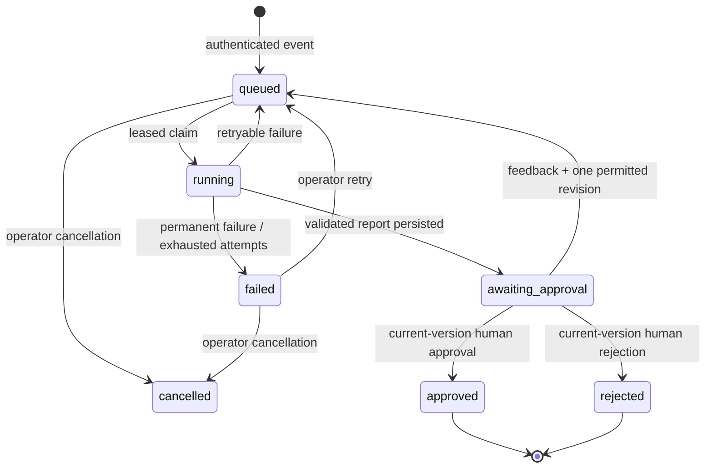

# Execution design and trade-offs

## State transitions

The worker checkpoints frozen evidence and the validated research dossier before analysis. A revision reuses research and runs a fresh AutoGen team with saved human feedback. Old report versions remain in `reports`; review decisions remain in `audit`.

## Framework boundaries

The collector fetches allowlisted public pages before model execution. CrewAI receives that evidence packet; its verifier produces the Pydantic research contract. Exact citation excerpts must occur in saved source text. AutoGen receives only the validated dossier and synthetic/adapted business context, then produces a strategy report in three agent turns. Report actions may reference only sources already cited by research findings.

Quote presence does not prove a claim is entailed by the quote. The reviewer sees both, and strategic claims are presented as hypotheses. Recommendations include explicit validation steps. A robust future version can add an independent entailment judge and domain-expert evaluation corpus; it should not silently turn a source-ID check into an accuracy claim.

The native OpenAI-compatible CrewAI adapter has explicit provider routing; relying on its model-name auto-detection would incorrectly send some Groq models to a missing LiteLLM fallback. AutoGen uses the configured compatible endpoint with explicit model capabilities.

## Durable work and delivery

SQLite `BEGIN IMMEDIATE` serializes short state transitions locally. PostgreSQL uses a transaction-scoped advisory lock for the same single-workspace contract. The full regression suite runs against both backends. Claims carry random ownership tokens and expiring leases. A heartbeat extends the lease while a model or collector runs. Writes reject stale ownership. Network and model calls do not hold database transactions.

The outbox is inserted with the approval or report-ready transition. Delivery workers atomically claim rows, retain the stable delivery ID across retries, and persist safe HTTP receipts. Backend retries stop after five attempts. A downstream timeout is ambiguous, so delivery is at least once. No end-to-end exactly-once guarantee is made.

Provider request timeouts, CrewAI agent iteration/time limits, a three-turn council, bounded input text and daily run counts constrain execution. A synchronous CrewAI task runs in a thread; Python cannot forcibly terminate a blocked native thread. Durable leases protect state publication after ownership loss. A future process-isolated executor can enforce a strict whole-stage wall-clock cap.

The council retries a rate-limited model request up to three times, waiting 20, 40 and 60 seconds. This preserves completed conversation turns and stays within the worker's heartbeat lease. A remaining provider failure enters the durable run retry policy. Authentication and unavailable-model errors are permanent until an operator corrects configuration and retries. Cancellation applies only to queued or failed runs, so it does not claim to terminate an in-flight model request.

## Security boundary

- The webhook credential admits new signals, but cannot approve reports or read stored research.
- The dashboard password establishes a signed, expiring HttpOnly session. Mutations require CSRF and origin checks.
- Source hosts are exact allowlist entries. All resolved addresses must be public. TLS connects to the validated IP with the original hostname for certificate verification; redirects are checked independently.
- Credentials are environment-only and secret fields are never returned by status endpoints.
- Agents have no shell or network tools. Prompt instructions and provenance checks reduce, but do not eliminate, model susceptibility to adversarial source text.
- A report exposes fetched evidence and safe task outputs, not private chain-of-thought.
- SQLite and local evidence require filesystem access controls and backups. The default configuration is a single trusted operator, not an organization-wide permission system.

## Scaling path

The hosted deployment already uses Neon PostgreSQL for queue state, reports, frozen evidence and the outbox. For higher concurrency across multiple hosts, use row-level leases and object storage for large evidence packets. Add organization IDs, SSO/RBAC, per-tenant secrets, audit retention, independent evaluation gates and completion callbacks from integration workflows. Add process-isolated model stages, a provider capability registry, and explicit cost budgets. Replace the AutoGen adapter when moving to a maintained successor if the project requirements permit it.

## Portfolio discussion

Demonstrate a real source → dossier → critique → revised hypothesis → human review. Show one failure, not just a happy path. Explain that automation and approval were already present in prior projects, while this project adds cross-framework evidence contracts and an inspectable research-versus-critique comparison. Avoid attributing business impact to a launch without actual outcome data.
