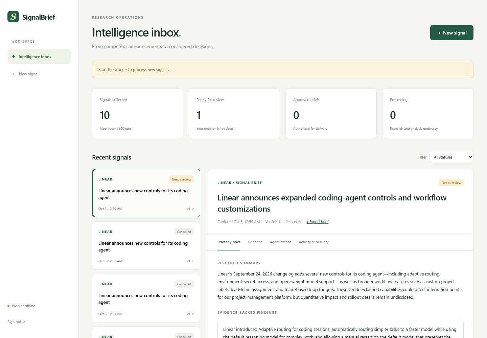

# Local setup and evaluation

## Run locally

Requires Python 3.11 and [uv](https://docs.astral.sh/uv/).

```powershell
uv sync --frozen --extra dev --python 3.11
uv run python -m signalbrief.setup
```

Open `.env` locally. The setup command generates a random dashboard password, webhook key, and session signing secret without printing them. Set:

```dotenv
LLM_PROVIDER=groq
LLM_MODEL=openai/gpt-oss-120b
GROQ_API_KEY=your-local-key
ZAPIER_HOOK_URL=https://hooks.zapier.com/hooks/catch/your-id/your-hook/
PUBLIC_BASE_URL=http://localhost:8000
```

Never commit `.env`. `LLM_API_KEY` takes precedence over provider-specific keys. For OpenAI, set `LLM_PROVIDER=openai`, an available OpenAI model ID, and `OPENAI_API_KEY`.

Start the API and worker in separate terminals:

```powershell
uv run uvicorn signalbrief.api:create_app --factory --host 127.0.0.1 --port 8000 --no-proxy-headers
uv run python -m signalbrief.worker
```

Alternatively run `powershell -ExecutionPolicy Bypass -File scripts/start.ps1`. The worker processes queued events and sends workflow notifications to the configured Zapier hook. Open [the dashboard](http://localhost:8000) and sign in with the generated `ADMIN_PASSWORD` from `.env`.

For the Groq account used in verification, the available model was `openai/gpt-oss-120b`; the older configured Llama ID returned HTTP 404. You can use the tested model and another local port without editing `.env`:

```powershell
powershell -ExecutionPolicy Bypass -File scripts/start.ps1 -Port 8008 -Model openai/gpt-oss-120b
```

This sets process environment overrides only. It starts normal processing and notification delivery. Groq quotas vary by account; the council retries temporary HTTP 429 responses with bounded pacing. The dashboard also lets you cancel queued or failed work while preserving its history.

When a model key or hook is missing, the Windows launcher offers hidden, session-only input instead of rewriting `.env`.

Create a signal from a registered competitor's public announcement. Inspect the actual evidence and framework outputs, then approve, reject, or request one revision. Approved reports can be downloaded as Markdown. A review notification contains a link, while an approved notification contains the reviewed summary and proposed actions.

## Register competitors

Edit `competitors.json`. Each entry defines a name, exact public-source hostnames, up to three reference pages, and your business context. The included context is synthetic and must be adapted for a real organization. Hostname matching is exact; register `www` and bare hosts separately if redirects require them.

The primary event source is mandatory. Optional reference failures are recorded as limitations. Fetched text, retrieval time, URL, and SHA-256 are saved in the run. Pages must serve readable HTML/text over HTTPS; oversized pages, blocked sites, and content rendered only in a browser fail explicitly. RSS titles are signals, not evidence of a product capability or its announcement date.

## Zapier setup

Follow [docs/ZAPIER.md](ZAPIER.md) for the two real Zaps, exact payloads, Slack field mappings, deduplication, and verification. A public HTTPS endpoint is required for Zapier to reach the local backend. Configure `PUBLIC_BASE_URL` and `SECURE_COOKIES=true` for HTTPS hosting; place the application behind a trusted TLS reverse proxy. Do not expose a development server or commit a hook URL.

If you do not have hosting or have not connected Slack yet, start with [Connect Slack and go live](CONNECT_SLACK_AND_GO_LIVE.md). It walks through the existing Catch Hook, a free ngrok HTTPS tunnel, the verified Linear RSS feed and an optional single-server deployment. The launcher can set the public URL and tested model without rewriting `.env`.

## Reliability and security

- An event ID uniquely identifies an immutable payload. Concurrent duplicates create one run; conflicting reuse is rejected.
- SQLite transactions claim worker leases. Heartbeats retain ownership; stale workers cannot checkpoint or publish results.
- Evidence and research are checkpointed. Recovery and the single permitted revision reuse the frozen evidence instead of silently fetching a different research set.
- Approvals bind to report versions. Stale reviews fail; rejected reports cannot schedule approved delivery.
- Notifications are created in the same transaction as the corresponding state transition.
- Outbound HTTP failures retry with backoff. Permanent failures remain visible and can be replayed by an operator.
- Delivery is **at least once**. A timeout after remote acceptance may cause a duplicate. Every retry retains `delivery_id`; configure a Zapier deduplication step before Slack.
- A successful Catch Hook response means **Zapier acceptance**, not confirmed Slack delivery. Use Zap History for the final action's result.
- Dashboard access uses signed HttpOnly sessions, CSRF tokens, origin checks, login throttling, and a same-origin content security policy. The webhook uses an independent `X-API-Key` header.
- Source collection enforces exact hostname allowlists, public IP checks, DNS-pinned TLS connections, bounded reads and redirect validation. Agents receive source data as untrusted content.
- Run and message logs never contain provider keys or hook URLs. API errors hide model exception bodies.
- Daily run count, source sizes, agent iterations, message count and provider timeouts bound work. Token use is recorded; there is no hard monetary billing guarantee.

## Verification and evaluation

```powershell
uv run ruff check signalbrief scripts tests
uv run pytest -q
uv run python scripts/live_verify.py
uv run python scripts/live_verify.py --run-id EXISTING_RUN_ID
uv run python -m signalbrief.evaluation --run-id YOUR_RUN_ID
```

`live_verify.py` collects real public Linear evidence and calls the actual CrewAI and AutoGen adapters. It saves a draft and **does not approve or deliver it**. Use it only after authorizing the selected provider to process your evidence and context. Normal runtime has no mock mode. Unit tests use isolated synthetic fixtures and substituted external boundaries to exercise failures without credentials.



`scripts/verify_delivery.py` sends exactly one clearly labelled connectivity notification; run it only when the operator has authorized the destination. The verification outputs stay under ignored `data/`.

The evaluation compares the stored research-only actions and post-critique actions, verifies exact quotes and source IDs, and records validation steps, owners, latency and token counts. These are structural and traceability measures. They do not prove factual entailment, strategic usefulness, or a reduction in hallucination. The generated human-review rubric supports an independent assessment.

## Docker

```powershell
docker compose up --build
```

The API and worker share one SQLite volume. Keep the app on a single host with local filesystem storage. Do not place SQLite on a network filesystem or scale this Compose deployment across hosts. Database and public-source evidence contain business research; manage backups and filesystem access accordingly.

## Repository map

```text
signalbrief/
  api.py          authentication, ingestion, dashboard endpoints, review and export
  store.py        durable queue, leases, checkpoints, version history, audit and outbox
  sources.py      allowlisted public HTTPS collection with pinned DNS
  agents.py       actual CrewAI and AutoGen adapters and validated handoff
  worker.py       checkpointed execution and bounded recovery
  delivery.py     real Zapier webhook delivery and receipts
  evaluation.py  stored-run baseline comparison
  static/         responsive review dashboard
scripts/          launcher and explicit live verification tools
tests/            security, evidence, concurrency, approval and failure tests
docs/             Zapier setup, architecture, verification record and interview guidance
```

